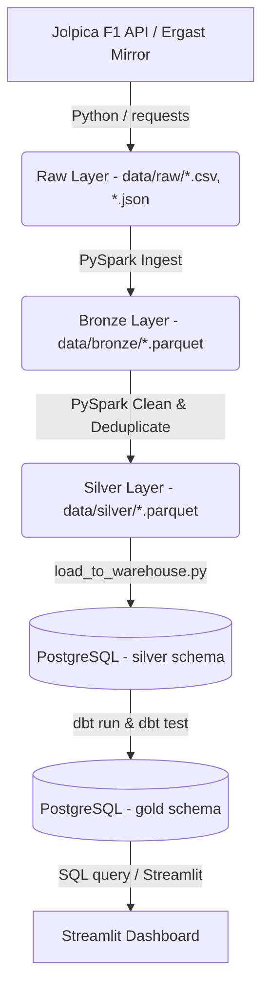

# Formula 1 Data Engineering Pipeline

This project is an end-to-end data engineering pipeline built using Formula 1 historical racing data.

## Architecture

```mermaid
graph TD
    A[Jolpica F1 API / Ergast Mirror] -->|Python / requests| B(Raw Layer - data/raw/*.csv, *.json)
    B -->|PySpark Ingest| C(Bronze Layer - data/bronze/*.parquet)
    C -->|PySpark Clean & Deduplicate| D(Silver Layer - data/silver/*.parquet)
    D -->|load_to_warehouse.py| E[(PostgreSQL - silver schema)]
    E -->|dbt run & dbt test| F[(PostgreSQL - gold schema)]
    F -->|SQL query / Streamlit| G[Streamlit Dashboard]
```
